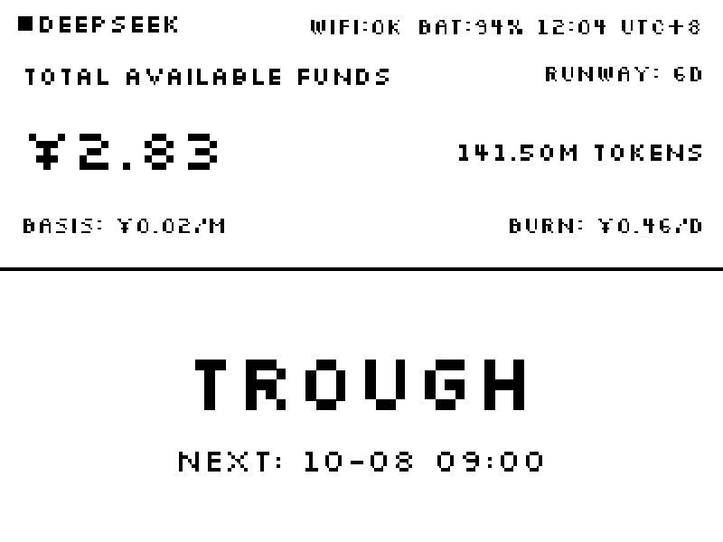

<p align="center">
  <h1 align="center">DeepSeek Monitor</h1>
  <p align="center">An ESP32-S3 desk display for your DeepSeek account balance and token price.</p>
</p>

<p align="center">
  
</p>

<p align="center">
  <a href="#overview" title="What this is">Overview</a> •
  <a href="#what-it-shows" title="The screen contents">What it shows</a> •
  <a href="#hardware" title="What you need">Hardware</a> •
  <a href="#quick-start" title="Build, flash, provision">Quick start</a> •
  <a href="#how-the-numbers-are-derived" title="BURN, RUNWAY and the token estimate">How the numbers work</a> •
  <a href="#layout" title="What lives where">Layout</a>
</p>

## Overview

**DeepSeek Monitor** is firmware for the [Waveshare ESP32-S3-RLCD-4.2](https://www.waveshare.com/wiki/ESP32-S3-RLCD-4.2)
board. It turns the board into a small always-on display for a DeepSeek API account: the
account balance, the token equivalent of that balance, the current tariff state, and when
the price next changes.

**Self-contained**: the board talks to `api.deepseek.com` over HTTPS directly. There is no
server, no cloud service, no companion app, and no account to create beyond your own
DeepSeek API key.

**Readable in daylight**: the ST7305 is a reflective monochrome panel — it keeps its image
with no backlight and no continuous refresh, and gets sharper as the room gets brighter.
That suits a display that sits on a desk showing one number all day.

**Automatic**: there are no menus. Holding the BOOT button reopens the WiFi setup page;
everything else happens on its own.

**Reproduces a design**: the screen follows the exports in
[`stitch_pixel_deepseek_status_display/`](stitch_pixel_deepseek_status_display), including the
typeface (**Silkscreen**), the measured font sizes, and the block positions.

## What it shows


```
■ DEEPSEEK                 WIFI:OK BAT:94% 12:04 UTC+8
TOTAL AVAILABLE FUNDS                        RUNWAY: 6D
¥2.83                                    141.50M TOKENS
BASIS: ¥0.02/M                             BURN: ¥0.46/D
───────────────────────────────────────────────────────
                       TROUGH
                    NEXT: 10-08 09:00
```

A 400×300 canvas in three bands:

| Band | Height | Contents |
|---|---|---|
| Status bar | 26 px | Device mark, WiFi and battery state, clock in Beijing time |
| Balance | 124 px | Balance, token equivalent, runway, burn rate, the rate the estimate used |
| Pricing | 150 px | Tariff state, and the time of the next change |

**Only the pricing band inverts** — dark for PEAK, light for TROUGH — so the tariff state is
readable from across a room without reading any text.

## Hardware

| Item | Value |
|---|---|
| Board | Waveshare ESP32-S3-RLCD-4.2 |
| Panel | ST7305 reflective monochrome, **400×300 landscape**, 1 bpp, SPI |
| Panel pins | CLK=GPIO11, MOSI=GPIO12, CS=GPIO40, DC=GPIO5, RST=GPIO41, TE=GPIO6 |
| Battery sense | GPIO4 through a 3× divider (18650 holder) |
| Buttons | BOOT=GPIO0, KEY=GPIO18 (both active low) |
| Memory | 8 MB octal PSRAM @ 80 MHz, 16 MB QIO flash |

The board exposes a USB-Serial/JTAG console and resets automatically when `idf.py` opens the
port, so flashing needs no button press.

## Quick start

**1. Build.** ESP-IDF **v6.1** is required.

```bat
cd firmware
build.bat build
```

`build.bat` reads `IDF_PATH` and `IDF_TOOLS_PATH` from the environment, falling back to the
standard Windows install locations. LVGL 9.5 and cJSON 1.7.19 are fetched by the ESP-IDF
component manager on the first build.

**2. Flash.** Replace `COM7` with your port.

```bat
build.bat -p COM7 -b 921600 flash
```

**3. Provision.** A fresh board has no credentials, so it raises its own access point:

1. Join the WiFi network **`DeepSeek-Monitor`** (open, no password).
2. Open <http://192.168.4.1/>.
3. Enter a **2.4 GHz** SSID, its password, and your DeepSeek API key.
4. Submit. The board drops the access point, joins your network, syncs the clock over SNTP,
   and takes its first balance reading.

Hold **BOOT for about 3 seconds** at any time to reopen the setup page. Credentials live in
NVS and survive an application reflash.

> The ESP32-S3 radio is 2.4 GHz only, so a 5 GHz-only network will not work.

## How the numbers are derived

DeepSeek publishes only `GET /user/balance` — there is no spending-history, usage, or billing
endpoint — so `BURN` and `RUNWAY` are computed on the device from the balance itself.

The ledger keeps two running totals in NVS rather than a window of samples:

```
spent_cf      total CNY spent since monitoring began, in 0.01-fen units
elapsed_s     total seconds monitored
ref_balance   the balance the next delta is measured against
```

Every poll (5 minutes by default) folds in one reading:

```
delta = ref_balance - new_balance
if delta > 0:  spent_cf += delta;  elapsed_s += time since last reading
ref_balance = new_balance
```

A *rising* balance means a top-up or a corrected reading, so the reference moves up and no
spend is recorded for that interval. Then:

```
BURN   = spent × 86400 / elapsed        CNY per day
RUNWAY = balance / BURN                 days remaining
```

Because `elapsed` only ever grows, the window is the whole monitored period — a lifetime
average rather than a recent trend. Both fields show `--` until an hour of history exists.

**Token equivalent** is `balance ÷ current cache-hit input price × 1M`, using the peak price
during peak hours and the off-peak price otherwise. `BASIS` shows that same rate, so the
arithmetic can be checked by eye.

**Tariff state** follows the [DeepSeek pricing page](https://api-docs.deepseek.com/zh-cn/quick_start/pricing):
peak is Monday–Friday 09:00–12:00 and 14:00–18:00 **Beijing time**, excluding Chinese
statutory holidays; off-peak is everything else, including weekends and holidays all day.
Off-peak prices are exactly half of peak. Holidays and compensatory workdays for 2026 are in
`firmware/main/holidays_2026.cpp`.

### Refresh cadence and power

| Interval | Effect |
|---|---|
| 3 minutes | API poll, and one ledger update |
| 1 minute | Repaint: clock, battery, tariff state |

The poll interval trades power against accuracy: each poll costs a TLS handshake and a radio
wake-up, while a shorter interval means less consumption is lost when a top-up lands in the
same window as spending. At three minutes that loss stays under a percent.

Two things matter far more to battery life than the interval: **WiFi modem sleep** is
enabled, so the radio is not sitting in the receive chain permanently, and the control loop
sleeps to its next deadline instead of waking every second. NVS wear at this cadence is
around 38 years, worked out in `firmware/main/usage_ledger.cpp`.

## Layout

```
.
├── firmware/                              ESP-IDF project — this is the buildable part
│   ├── main/                              application sources
│   │   ├── fonts/                         generated 1 bpp Silkscreen faces
│   │   ├── board_rlcd.cpp                 SPI, esp_lcd panel IO, ST7305 init, flush
│   │   ├── ui.cpp                         layout, tariff inversion, all copy
│   │   ├── pricing.cpp                    peak/off-peak rules and price table
│   │   ├── usage_ledger.cpp               running totals, burn rate, runway
│   │   ├── deepseek_api.cpp               GET /user/balance over HTTPS
│   │   ├── wifi_portal.cpp                SoftAP setup page
│   │   └── ...
│   ├── partitions.csv                     16 MB flash layout
│   ├── sdkconfig.defaults                 target, PSRAM, task stacks
│   └── README.md                          firmware detail: internals and rationale
├── stitch_pixel_deepseek_status_display/  the four design exports
└── docs/                                  images used by this README
```

`firmware/README.md` goes deeper: the font pipeline, the LVGL locking requirement, the
display's byte packing, and the reasoning behind each threshold.

## Licence

The firmware is provided as-is. LVGL is distributed under the MIT licence. Silkscreen is
distributed under the SIL Open Font License.
